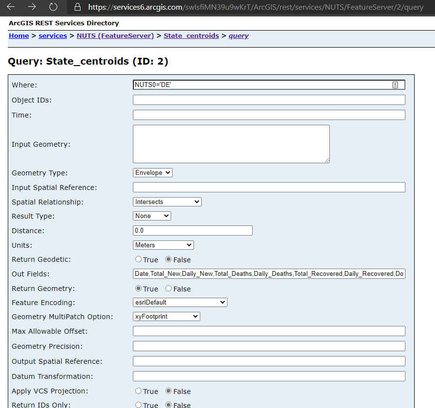

# 60thGPC.github.io

### Main NUTS Site
https://services6.arcgis.com/swIsfiMN39u9wKrT/ArcGIS/rest/services/NUTS/FeatureServer

### Example NUTS Query
https://services6.arcgis.com/swIsfiMN39u9wKrT/ArcGIS/rest/services/NUTS/FeatureServer/2/query

Out Fields: Date,Total_New,Daily_New,Total_Deaths,Daily_Deaths,Total_Recovered,Daily_Recovered,Infections_per_100k,R0,Doubling_Rate

